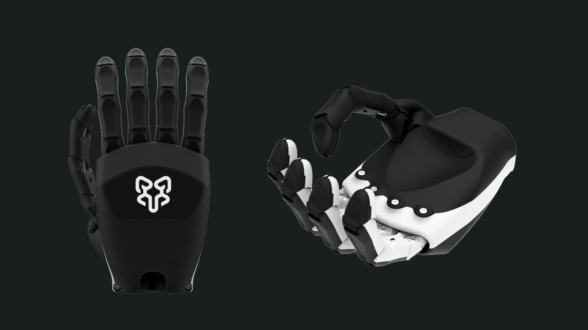

# RoninHand

---

The RoninHand is an open-source, tendon-driven dexterous hand. It leverages a semi print-in-place (PIP) design that consolidates the core structure into just three 3D-printed parts to streamline assembly. The design is engineered to use common, off-the-shelf hardware, making it a practical platform for makers, researchers, and hobbyists.

## Design and Capabilities

*   **Degrees of Freedom:** 20 total (15 active).
*   **Onboard Actuation:** The palm houses 12 Feetech SCS0009 servos for primary motion.
*   **Current Configuration:** Finger abduction/adduction (side-to-side motion) is mechanically locked in the hand-only version. The system is designed for future integration with a forearm that will house the remaining actuators.

## Printed Parts & Assembly

The core structure consists of 3 main 3D-printed parts:

1.  **The Dorsal Assembly:** Includes the four fingers and the back of the hand, all printed as a single articulated piece.
2.  **The Palmar Assembly:** Includes the thumb and the palm. This part has an opening to insert servos and connect the tendons to the servo horns.
3.  **The Cover:** Snaps onto the palmar assembly to cover the opening, requiring no fasteners.

## Project Status

> **V1.0 Files Released!**
> We are excited to release the initial set of files for the RoninHand. This includes the first version of the STLs for printing and a draft Bill of Materials (BoM) to help you get started.
>
> **Coming Soon:**
> *   Step-by-step assembly documentation.
> *   Getting-started code examples.

## Draft Bill of Materials (Per Hand)

> ⚠️ **Note:** This Bill of Materials is a **draft** and currently under development. Some specifications are still to be confirmed.  
> 💡 The components listed have similar specifications, but the **specific brands or vendors (e.g., fishing line) have not yet been tested or verified**.  
> 💡 **Prices listed do not include shipping, taxes, tariffs, or import duties.** Final costs may vary based on supplier location and order volume.

| **Component**                                           | **Quantity**     | **Canada (CAD)** | **USA (USD)** | **Links / Options** |
|---------------------------------------------------------|------------------|------------------|---------------|---------------------|
| Feetech SCS0009 Digital Servos                          | 11               | $104.28          | $75.13        | [Alibaba](https://www.alibaba.com/product-detail/Feetech-SCS0009-Digital-Servo-Core-Motor_1601132782119.html) |
| Serial Bus Servo Driver Board                           | 1                | $15.99           | $10.56        | Primary: [Canada](https://a.co/d/0MlaECV), [USA](https://a.co/d/gL7aJlg)   🔁 Alternative: [Feetech FE-URT-1](https://www.alibaba.com/product-detail/Feetech-FE-URT-1-Multi-function_1600157148551.html) – CA$9.79 / US$7.05 |
| M3 x 4 x 5 mm Threaded Heat-Set Inserts                 | 1                | $8.99            | $9.99         | [Canada](https://a.co/d/2b9fAcn), [USA](https://a.co/d/ioDsj4n) |
| M3 x 12 mm Hex Socket Head Cap Screws                   | 1                | $10.36           | $8.99         | [Canada](https://a.co/d/2T5ncxA), [USA](https://a.co/d/d5m2FtP) |
| Fishing Line (80 lb min, Ø 0.35–0.45 mm)                | 1                | $30.00           | $37.95        | Option 1: [Canada](https://a.co/d/7zkHzXg), [USA](https://a.co/d/fsu0T7f)   Option 2: [Canada](https://a.co/d/fL8LNx7), [USA](https://a.co/d/8J0bi1C) |
| Compression Springs (0.4mm×4mm×25mm, TBD)               | 1                | $4.46            | $2.44         | [Canada](https://a.co/d/gh0GoGx), [USA](https://a.co/d/gZyBecZ) |
| Compression Springs (0.4mm×4mm×30mm, TBD)               | 1                | $4.46            | $2.44         | [Canada](https://a.co/d/7r5wzIo), [USA](https://a.co/d/5N2RI5o) |
| 5V 2A DC Power Supply Adapter                           | 1                | $10.99           | $5.99         | [Canada](https://a.co/d/jaY6SDO), [USA](https://a.co/d/4bJZZjK) |

---

| **Total Estimated Cost** | 🇨🇦 Canada: **$189.53 CAD** | 🇺🇸 USA: **$153.49 USD** |
|--------------------------|-----------------------------|--------------------------|

> **💡 A Note on Springs:** As a temporary or testing alternative, you can take springs out of some ballpoint pens you may have lying around. While the ideal springs are listed above, a pen spring with similar dimensions can work in a pinch.

## Community & Contribution

This is a new project, and we want to build its future with you. There is lots of room for improvement in design, documentation, and software.

💬 **[Join our Discord Channel!](https://discord.gg/pruFaV6f6D)**
This is the best place to ask for help with your build, share your modifications, or brainstorm ideas for the future of the project.

We welcome all contributions! Please feel free to open an issue or submit a pull request once the project files are available.

## License

This project is made available under a dual-license structure. The project as a whole is licensed under the Apache 2.0 License, with specific exceptions for the mechanical design files.

### Overall Project & Software

The RoninHand project, including all documentation, software, and code, is licensed under the **Apache 2.0 License**. Please see the `LICENSE` file for the full text.

### Mechanical Design Files

All mechanical design files, including CAD and STL files, are an exception to the above and are licensed separately under the **Creative Commons Attribution 4.0 International License**. This allows you to share and adapt the design for any purpose, even commercially, as long as you give appropriate credit.

[![CC BY 4.0][cc-by-shield]][cc-by]

[cc-by]: http://creativecommons.org/licenses/by/4.0/
[cc-by-shield]: https://img.shields.io/badge/License-CC%20BY%204.0-lightgrey.svg