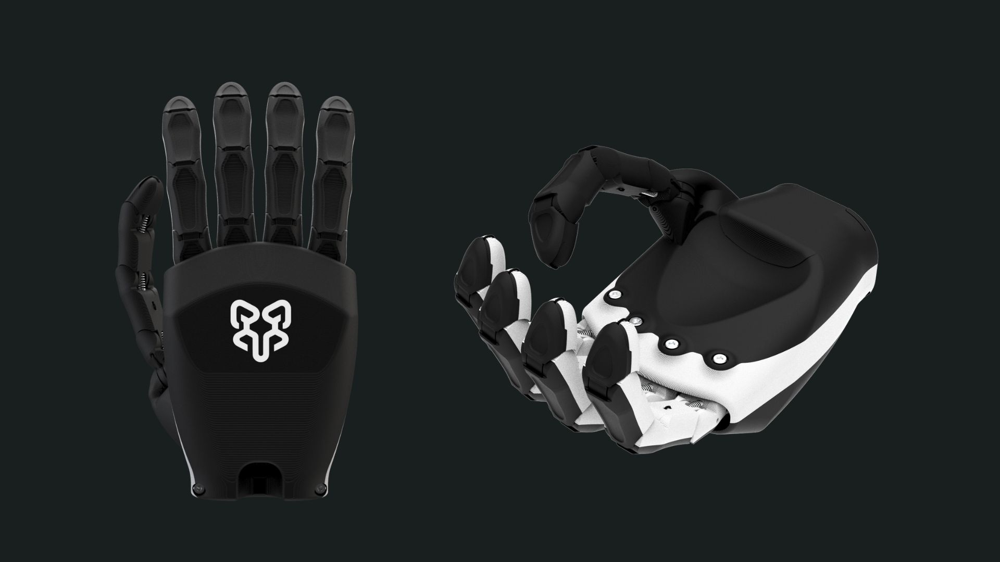

# RoninHand

The RoninHand is an open-source, tendon-driven dexterous hand. It leverages a semi print-in-place (PIP) design that consolidates the core structure into just three 3D-printed parts to streamline assembly. The design is engineered to use common, off-the-shelf hardware, making it a practical platform for makers, researchers, and hobbyists.

## Documentation

Full assembly instructions, configuration details, and usage guides are available in the project’s documentation.  
Click below to explore the complete build guide:

## License

This project is made available under a dual-license structure. The project as a whole is licensed under the Apache 2.0 License, with specific exceptions for the mechanical design files.

### Overall Project & Software

The RoninHand project, including all documentation, software, and code, is licensed under the **Apache 2.0 License**. Please see the `LICENSE` file for the full text.

### Mechanical Design Files

All mechanical design files, including CAD and STL files, are an exception to the above and are licensed separately under the **Creative Commons Attribution 4.0 International License**. This allows you to share and adapt the design for any purpose, even commercially, as long as you give appropriate credit.

[![CC BY 4.0][cc-by-shield]][cc-by]

[cc-by]: http://creativecommons.org/licenses/by/4.0/
[cc-by-shield]: https://img.shields.io/badge/License-CC%20BY%204.0-lightgrey.svg
