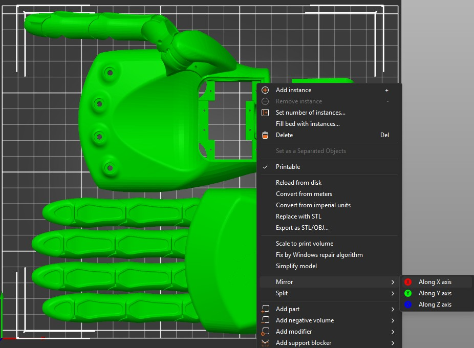

# RoninHand Printing Guide

This guide provides the recommended settings and procedures for successfully printing the RoninHand components.

****.

## 1. File Overview

Inside this folder, you will find two options for printing:

1.  **`RoninHand_All_Parts.stl`:** A single file with all three components laid out on one plate.
2.  **Individual Files:**
    *   `Dorsal_Assembly.stl`
    *   `Palmar_Assembly.stl`
    *   `Palm_Cover.stl`

If the `All_Parts` file does not fit on your build plate, the individual files are provided.

> **First-Time Print Recommendation:**
> We strongly recommend printing the individual parts for your first attempt. Start by printing only `Palmar_Assembly.stl`. This part tests the most critical tolerances. If it prints successfully, the other components should work as well.
>
> **Pay close attention to which face of each model is positioned flat on the build plate.** This orientation is essential for correct support generation.

## 2. How to Print a Left Hand

By default, the provided STL files will build a **Right Hand**.

The `Dorsal_Assembly.stl` and `Palm_Cover.stl` parts are universal and are used for both left and right hands. The only part that determines the hand's orientation is the `Palmar_Assembly.stl`.

To build a **Left Hand**, you must mirror the necessary part(s) in your slicer software (e.g., PrusaSlicer, Cura, Bambu Studio).

> **To create a Left Hand:**
>
> *   **If printing individual parts:** Import `Palmar_Assembly.stl` into your slicer, right-click on it, and use the "Mirror" function (typically on the X-axis). The other parts remain unchanged.
> *   **If printing the all-in-one plate:** Import `RoninHand_All_Parts.stl` and mirror the entire plate in the same way.

Below is an example of the 'Mirror' function in a typical slicer:

## 3. Print Parameters

These settings have been tested and are recommended for a successful print.

| Parameter                   | Recommended Setting            | Notes                                                |
| --------------------------- | ------------------------------ | ---------------------------------------------------- |
| **Material**                | PLA / PLA+                     |                                                      |
| **Nozzle Diameter**         | 0.4mm                          |                                                      |
| **Layer Height**            | 0.2mm                          |                                                      |
| **Infill Density**          | 20% - 100%                     | 20% is fine for initial tests; 100% for final strength. |
| **Wall Line Count**         | 6 Perimeters                   | Critical for the strength of joints and tendon channels. |
| **Support**                 | Yes, on build plate only.      | Do not use tree supports inside the model.           |
| **Build Plate Adhesion**    | Brim                           | Helps prevent warping on the large flat surfaces.    |

## 4. Post-Processing: Support & Brim Removal

1.  **Remove from Bed:** Carefully use a putty knife to scrape the parts off the print bed.
2.  **Clean the Brim:** Use a precision knife or a deburring tool to clean the edges where the brim was attached.
3.  **Remove Supports:** Use pliers and tweezers to carefully remove the support material from all overhangs and internal cavities.

### 💡 A Tip for Finger Supports

The supports inside the finger joints can be time-consuming to remove. To make it easier, *gently* bend each joint back and forth. This helps break the internal supports free so you can pull them out with tweezers. Be careful not to apply too much force, as this could damage the joint.